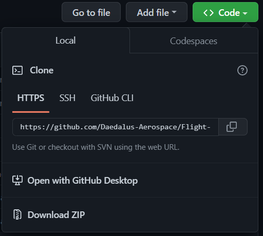

# Flight-Test-Data-Analytics-Module-01

This repository supports Module 01 of the [Daedalus Aerospace Flight Test Data Analytics course](https://www.daedalusaero.space/courses/flight-test-data-analytics).

## Feedback

Please use the [GitHub Issues page](https://github.com/Daedalus-Aerospace/Flight-Test-Data-Analytics-Module-01/issues) to provide feedback.

## Code

Code is available here at <https://github.com/Daedalus-Aerospace/Flight-Test-Data-Analytics-Module-01>

Click on the `<> Code ▼` button for options

### Download as zip file

- [Download ZIP](https://github.com/Daedalus-Aerospace/Flight-Test-Data-Analytics-Module-01/archive/refs/heads/main.zip) will provide you a local copy.
- Save to a convenient location, unzip the file, and run the code from the `Flight-Test-Data-Analytics-Module-01` folder.

### Open with GitHub Desktop

- [GitHub Desktop](https://desktop.github.com/) is a local application that provides a graphical user interface for using `git` and `GitHub`.
- [Open with GitHub Desktop](x-github-client://openRepo/https://github.com/Daedalus-Aerospace/Flight-Test-Data-Analytics-Module-01) helps automate the local repository cloning process.

### Clone

- For those familiar with `git` and `GitHub` and working with git repositories, the repository may be cloned using HTTPS, SSH, or the [GitHub CLI](https://cli.github.com/) (Command Line Interface)

## Setup

This course assumes you have installed the Anaconda Distribution, available at <https://www.anaconda.com/products/distribution#Downloads>

Spyder is an integrated development environment (IDE) that comes bundled with the Anaconda Distribution. There is no requirement that Spyder be used to run and explore this code, but Spyder is used during course development and in the course videos.

### Conda environment and Spyder

The conda environment used for the module is available as `environment.yml`

To import the environment and open the Spyder IDE, you have two ways of doing so:

1. Anaconda Navigator
    1. Open Anaconda Navigator
    2. From the left sidebar menu select "Environments"
    3. At the bottom of the window select "Import"
    4. From "Local Drive" browse to the folder Flight-Test-Data-Analytics-Module-01 and select `environment.yml`
    5. Name the environment "ftda_m01"
    6. Once installation is complete, select "ftda_m01" from the available environments
    7. Click the play button, and select "Open in Terminal"
    8. In the terminal, type `spyder` and hit Enter
2. Anaconda Terminal/PowerShell
    1. Open Anaconda Terminal or Anaconda PowerShell
    2. In the terminal, navigate to the folder Flight-Test-Data-Analytics-Module-01
    3. Type `conda env create -f environment.yml` and hit Enter
    4. Agree to changes
    5. Once installation is complete, type `conda activate ftda_m01`
    6. Type `spyder` and hit Enter
